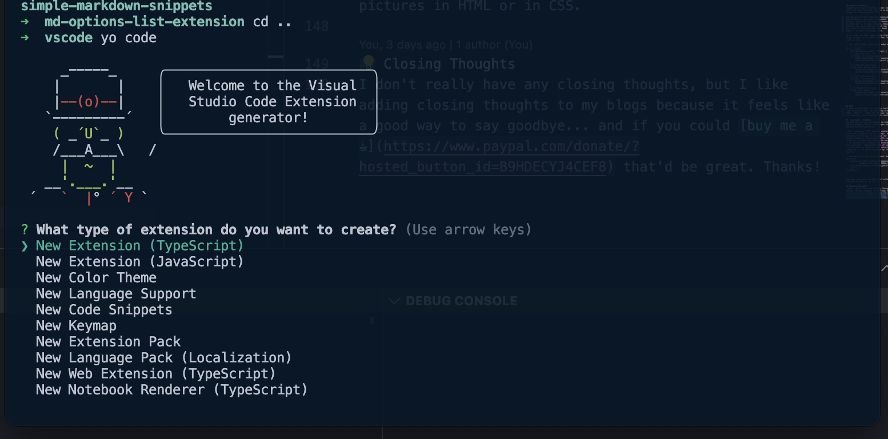

I will go through the steps on how to create your own VSCode Snippet Extension.

## Installation
You would first need to install [Yeoman](https://yeoman.io). This is a web scaffolding tool and a VS Code Extension Generator

import Tabs from '@theme/Tabs';
import TabItem from '@theme/TabItem';

<Tabs>
<TabItem value='npm' label='npm' default>

```bash
npm install -g yo generator-code
```

</TabItem>
<TabItem value='yarn' label='Yarn'>

```bash
yarn add -g yo generator-code
```

</TabItem>
</Tabs>

Then, inside your extension folder, you run
```bash
yo code
```

Pick the type of extension you would like to create. For this blog, I picked New Code Snippets.

 

Then answer a bunch of questions to create the extension:
- Folder name for import or leave blank for a new extension
- What's the name of your extension
- What's the identifier of your extension
- What's the description of your extension
- Enter the language in which the snippets should appear. The id is an identifier and is a single, lowercase name such as 'php', 'javascript' (For this I used 'markdown')
- Initialize a git repository

🎉Congratulations🎉 you're a few steps closer to publishing your extension!

## Configuring your VS Code for Snippet Development

In the generated project, there should be a *vsc-extension-quickstart.md* where it teaches you how to load your snippet in an [Extension Host](https://code.visualstudio.com/api/advanced-topics/extension-host). If you're a dumbass like me, your snippet may not be popping up on your IntelliSense right away. Turns out you have to **F1 -> Insert Snippet** to see if it's installed. To make it work in IntelliSense you need to add the JSON below to your **settings.json**
```json title='settings.json'
"[markdown]": { 
    "editor.quickSuggestions": { 
        "other": "on", 
        "comments": "inline", 
        "strings": "inline" 
    } 
}
```

Of course, if you're not creating a snippet for markdown, you need to update the **settings.json** accordingly.

## Creating New Snippets

Now comes the easy part, creating the snippets.

In snippets/snippets.code-snippets, you can add your snippet objects. In a snippet object, you have different properties that makes up the object:
- prefix: The prefix that should trigger IntelliSense to suggest your snippet
- body: The snippet itself.
- description: The description of the snippet

```json title='snippet object'
"Markdown Link Snippet": { // Name of the snippet
    "prefix": "!link", // Prefix
    "body": "[${1:name}](${2:address})", // Body
    "description": "Markdown 'link' template" // Description
}
```

The name of the snippet ***Markdown Link Snippet*** is important if you want to reference your snippet somewhere in VSCode, like **keybindings.json** so you can register keybindings to trigger your snippets. To learn how to do this, you can fast forward to [Selected Text Keybinding](#selected-text-keybinding)

### Multi-Line Snippet

If you want your snippet to generate multiple lines, then you need to make the body of the snippet an array of strings, where every string is a new line.

```json title='snippets/snippets.code-snippets'
{
    "Markdown Frontmatter Snippet": { 
        "prefix": "!fmatter",
        "body": [
            "---",
            "slug: $1",
            "title: $2",
            "authors: $3",
            "tags: [$4]",
            "---"
        ],
        "description": "Markdown 'front matter' template"
    }
}
```

### Single Line Snippet
If you just want to create a single line snippet, then you can just make the body a string
```json title='single line snippet'
"Markdown Image Snippet": {
    "prefix": "!image",
    "body": " $0"
}
```

## Tab Stops
The `$n`'s (where n is a number) that you see in the examples above are **tab stops**. This is where the snippet will insert the cursor on every tab. You can have as much tabs stops as you want in a snippet. 

The `$0` is reserved for where the cursor will end up after all the tab stops have been hit.

### Options
You can also add options to your tab stops. for example, If you want to create a code block that suggests language options supported for MDX, you can do something like this
```json title='codeblock with options'
"Markdown Code Snippet": {
    "prefix": "!codeblock",
    "body": [
        // highlight-next-line
        "```${1|markup,bash,clike,c,cpp,css,javascript,jsx,coffeescript,diff,git,go,graphql,handlebars,json,less,makefile,markdown,objectivec,ocaml,python,reason,sass,scss,sql,stylus,tsx,typescript,wasm,yaml|} title='${2:Title}'",
        "$0",
        "```"
    ],
    "description": "Markdown 'code' template"
}
```

Where the tab stops are enclosed in curly brackets, and the options are enclosed in the pipe symbols delimited with a comma `${1|options,for,tab,stops,here|}`

:::note Tab Stop Options
Don't put any spaces after the comma in your tab stop options for formatting. MDX will see the spaces as part of the option value.
:::

### Placeholders
You can also add placeholders. An example of this is if you want to make it clear to your users what data or value should be added to a particular tab stop.
```json title='placeholders'
"Markdown React Export Components": {
    "prefix": "!export-component",
    "body": [
        // highlight-next-line
        "export const ${1:name} = ({${2:prop1}, ${3:prop2}}) => (",
        "$0",
        ");"
    ],
    "description": "Markdown 'ReactJs Export Component' template"
}
```

This is the same format as options, except we use a colon symbol instead of pipe symbols and just put the placeholder you want to display `${1:name}`

## Selected Text Keybinding
I always had an easy time writing documentation on [Jira Confluence](https://www.atlassian.com/software/confluence) because of the different features we can use to make it easier to write markdown. Like how you can just <mark>highlight</mark> a text, and then trigger a hotkey like **cmd+b** to turn the selected text **bold**. 

So I wanted to bring those features with me when I write Docusaurus blogs in VSCode. Here's how I did it.

### TM_SELECTED_TEXT
**TM_SELECTED_TEXT** is a variable. It holds the currently selected text in your VSCode editor, so we can use this in our snippet body to enclose the selected text with whatever we want to enclose it with.
```json title='TM_SELECTED_TEXT for bold'
"Markdown Bold Selected Text": {
    "prefix": "!bold",
    // highlight-next-line
    "body": "**${TM_SELECTED_TEXT:$1}**$0",
    "description": "Wrap the selected text with bold"
}
```
So actually just `${TM_SELECTED_TEXT}` Would suffice for what we want. But `${TM_SELECTED_TEXT:$1}` allows the snippet to default to just putting the cursor inside the bold symbols during the keybinding event if ever there is no selected text.

### keybindings.json

So we have the snippet ready, but we still need to add the **cmd+b** keybinding for this snippet. To do that we just need to update the *keybindings.json* file in VSCode. 

:::note How to open keybindings.json in VSCode
Just click on the settings cog on the bottom left, click Keyboard Shortcuts, and then click on the Open Keyboard Shortcuts(JSON) icon on the top write of the editor.
:::

In your keybindings.json file, you can add the keybinding object

<Tabs>
<TabItem value='mac' label='Mac 🍎' default>

```json title='keybindings.json object'
{
    "key": "cmd+shift+b",
    "command": "editor.action.insertSnippet",
    "when": "editorTextFocus",
    "args": {
        "langId": "markdown",
        "name": "Markdown Bold Selected Text"
    }
}
```

</TabItem>

<TabItem value='windows' label='Windows 🪟'>

```json title='keybindings.json object'
{
    "key": "ctrl+shift+b",
    "command": "editor.action.insertSnippet",
    "when": "editorTextFocus",
    "args": {
        "langId": "markdown",
        "name": "Markdown Bold Selected Text"
    }
}
```

</TabItem>
</Tabs>

There are tons of other commands you can use other than `editor.action.insertSnippet` but this is the one we need to use to have selected text keybinding for VSCode.

You can also change the `key` property value to whatever you want to change it to. Like **cmd+option+shift+1+2+3+up+down+left+right+side+to+side+bomb+b**...

## Publishing to VSCode

Congratulations! You create your snippet extension and now you can share it with everyone! 

This [Visual Studio documentation](https://code.visualstudio.com/api/working-with-extensions/publishing-extension) has a great write-up on a step-by-step guide on how to publish extensions and all the things you would want to do to your extension like versioning, deprecating, and packaging.

## Closing Thoughts
This blog just hits the tip of the iceberg with what you can do with VSCode extensions, but hopefully, you found it informative and helpful. If you liked it, consider [buying me a ☕️](https://www.paypal.com/donate/?hosted_button_id=B9HDECYJ4CEF8). Thanks! 