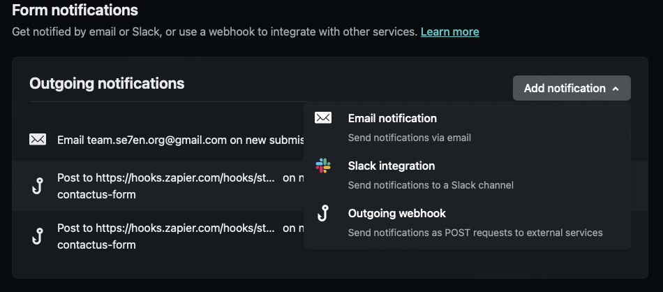

We will go through how to have your Contact Us page, integrate with Netlify Forms. This will then allow you to set up workflow automation like [Zapier](https://zapier.com) so you can then have it saved to an excel spreadsheet, or have a Discord bot send it to a channel. We will also go through [Spam Filters](#spam-filters) and the limitations of Netlify's Captcha implementation.

<!-- truncate -->

## HTML Form
Create an HTML form on your site with the fields you would want the user to input. Add `data-netlify="true"` attribute to the `<form>` tag. The Netlify bots use this so they know a submit from this form should go to your Netlify admin panel.

Your forms `name` attribute determines what the form will be called on Netlify's form page.

```markup title='contact-us form'
// highlight-next-line
<form data-netlify="true" name="quantum-cleaning-contactus-form" method="POST">
    <input type="hidden" name="subject" value="Sales inquiry from quantumcleaning.co" />
    <div class="row">
        <div class="form-group col-md-6">
            <label for="name">Full Name</label>
            <input type="name" class="form-control" id="name" name="name" required>
        </div>
        <div class="form-group col-md-6">
            <label for="Email">Email</label>
            <input type="email" class="form-control" id="Email" name="email" required>
        </div>
    </div>
    <div class="form-group">
        <label for="message">Message</label>
        <textarea class="form-control" id="message" rows="3" name="message" required></textarea>
    </div>
    <button type="submit" class="btn font-weight-bold atlas-cta atlas-cta-wide cta-brown my-3">Submit</button>
</form>
```

And that's it! You should now see your users submissions on your Netlify portal forms page.

## Spam Filters
We can add either a [honeypot field](#honeypot-field), a [reCAPTCHA 2](#recaptcha-2), or both to our form. These protections will deter annoying bots from trying to submit spam.

### Honeypot field
Honeypot fields are hidden fields that lure bots into completing a field that users won't be able to see. If a form is submitted with a honeypot field completed, that means that we can be sure that the form was submitted by a bot. To enable this, we just need to add a `netlify-honeypot` attribute to our `<form>` with the name of our hidden field. 

```markup title='contact-us form with honeypot'
<form data-netlify="true" 
    // highlight-next-line
      netlify-honeypot="le-trap"
      name="quantum-cleaning-contactus-form" 
      method="POST">
    <input type="hidden" name="subject" value="Sales inquiry from quantumcleaning.co" />
    <div class="row">
        <div class="form-group col-md-6">
            <label for="name">Full Name</label>
            <input type="name" class="form-control" id="name" name="name" required>
        </div>
        <div class="form-group col-md-6">
            <label for="Email">Email</label>
            <input type="email" class="form-control" id="Email" name="email" required>
        </div>
        <div class="hidden">
        // highlight-next-line
            <input name="le-trap" />
        </div>
    </div>
    <div class="form-group">
        <label for="message">Message</label>
        <textarea class="form-control" id="message" rows="3" name="message" required></textarea>
    </div>
    <button type="submit" class="btn font-weight-bold atlas-cta atlas-cta-wide cta-brown my-3">Submit</button>
</form>
```

Netlify's bots will automatically strip the `netlify-honeypot` attribute from the `<form>` tag, leaving the honeypot input field in place. ~Sneaky Sneaky~.

### reCAPTCHA 2
Netlify provides a CAPTCHA implementation. To implement CAPTCHA, add a `data-netlify-recaptcha="true"` attribute to your `<form>` tag, and place an empty `<div>` element inside your form with the same `data-netlify-recaptcha="true"` attribute.

:::tip reCAPTCHA position
The reCAPTCHA layout will appear wherever you place your div. So if you wanna be weird, you can place your reCAPTCHA at the start of your form instead of at the bottom.
:::

```markup title='contact-us form with reCAPTCHA'
<form data-netlify="true" data-netlify-recaptcha="true" name="quantum-cleaning-contactus-form" method="POST">
    <input type="hidden" name="subject" value="Sales inquiry from quantumcleaning.co" />
    <div class="row">
        <div class="form-group col-md-6">
            <label for="name">Full Name</label>
            <input type="name" class="form-control" id="name" name="name" required>
        </div>
        <div class="form-group col-md-6">
            <label for="Email">Email</label>
            <input type="email" class="form-control" id="Email" name="email" required>
        </div>
    </div>
    <div class="form-group">
        <label for="message">Message</label>
        <textarea class="form-control" id="message" rows="3" name="message" required></textarea>
    </div>
    <div data-netlify-recaptcha="true"></div>
    <button type="submit" class="btn font-weight-bold atlas-cta atlas-cta-wide cta-brown my-3">Submit</button>
</form>
```

import ReactPlayer from 'react-player/lazy';

### Netlify-provided reCAPTCHA shortcomings
:::caution Netlify reCAPTCHA shortcomings
The reCAPTCHA implementation works fine, but the issue is that there is no way to disable the form submit button when reCAPTCHA has not been completed or touched at all. 

What it does is that it sends the form but it doesn't display it on the Netlify admin site and also doesn't bring the user to the form submission successful page. I contacted Netlify about this issue but they haven't responded yet 🤔
:::

**reCAPTCHA being ignored**
<ReactPlayer playing controls url="/videos/2022-10-02-contact-us-netlify-forms/recaptcha-not-working-min.mp4"/>
<br />

**reCAPTCHA not ignored**
<ReactPlayer playing controls url="/videos/2022-10-02-contact-us-netlify-forms/recaptcha-working-min.mp4"/>

## Form Notifications
You can send notifications from verified submissions on the *Site Settings -> Forms -> Form Notifications* page.



Netlify has some integrations out of the box like Email notifications, Slack integration, and Outgoing webhooks.

### Email Notifications

#### Reply To
By default, Netlify's email notifications are sent from **formresponses@netlify.com**, and any replies from a notification go to that address. To respond to a form submitter, you need to enter their address manually. 

If you don't want to do that, Netlify suggests adding an email to your form with `<input name="email">`. This sets the reply-to value of the email to that value and now you can automatically reply to the submitter without having to do it manually.

#### Subject
The default subject for all form notification emails is as follows:

**[Netlify] Form submission from YOUR_FORM_NAME form**

You can’t override [Netlify] in the default subject, but you can override the rest. To do this, add an `<input name="subject" />` to your form. The value of that input will be used for the notification email subject, prepended by [Netlify]. This input does not need to be visible to your users.


### 3rd party automation integration
You can also integrate to 3rd party automation apps like [Zapier](https://zapier.com) or [n8n](https://n8n.io/). For this blog I will just go through [Zapier](https://zapier.com) because that's what I chose.

Login to Zapier or create an account. You will then be able to **Create your own workflow** by connecting Netlify to another app like Discord in the Zapier workflow creation tool. 

You will now be able to automate when a **New Form Submission** happens on **Netlify**, Zapier should **Send a Channel Message** to **Discord**.

<ReactPlayer playing controls url="/videos/2022-10-02-contact-us-netlify-forms/zapier-create-workflow.mov" />
<br />

There are a bunch more things you can integrate with Zapier. With my current website, I have it integrated into our Discord channel #contact-us-submissions so we are notified instantly when someone contacts us, and it also logs the submission in a Google Sheet for logging purposes.